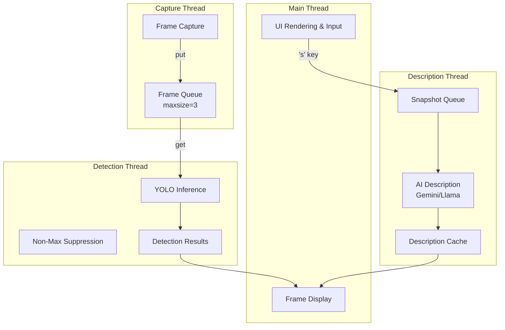
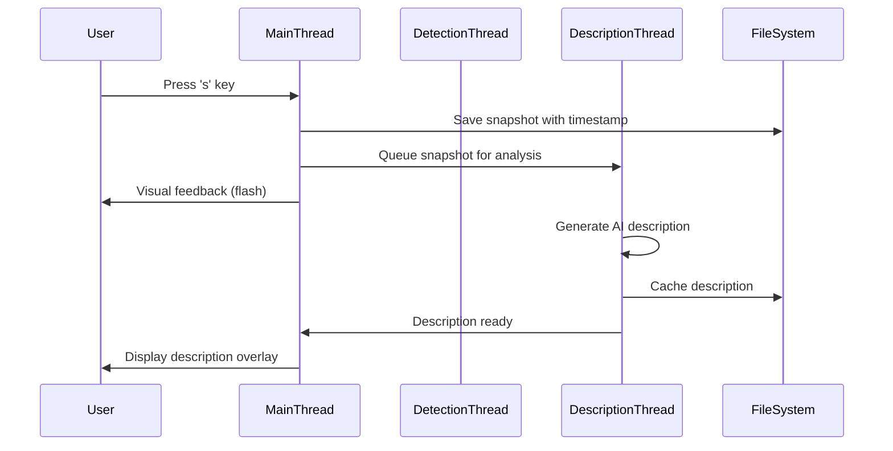

# Design Document: Detection Performance Enhancement

## Overview

This design document specifies the technical architecture for enhancing an existing object detection system that supports multiple implementations (YOLO + OpenCV, YOLO + Gemini/Llama, Gemini Camera). The enhancements focus on three primary areas:

1. **Performance Optimization**: Reducing inference latency, optimizing memory usage, and improving frame processing throughput
2. **Snapshot Workflow Enhancement**: Implementing efficient snapshot capture with asynchronous AI description generation
3. **System Robustness**: Improving threading architecture, error handling, and configuration management

The system currently processes webcam frames for real-time object detection but lacks optimization in frame processing, memory management, and user interaction workflows. This design addresses these gaps while maintaining compatibility with existing implementations.

### Key Design Goals

- Achieve <100ms inference latency for YOLO-based detection
- Maintain <2GB memory footprint during operation
- Support asynchronous snapshot capture and AI description generation
- Provide configurable detection parameters with persistent settings
- Implement robust threading architecture for concurrent operations
- Enable GPU acceleration when available

## Architecture

### High-Level Architecture

The system follows a **multi-threaded producer-consumer architecture** with three primary execution contexts:



### Threading Model

**Thread Separation Rationale**: Based on research into Python threading patterns ([source](https://cs.wellesley.edu/~cs304flask/readings/threads/producer-consumer.html)), the system uses separate threads for I/O-bound operations (frame capture, API calls) while keeping CPU-bound operations (YOLO inference) isolated. Python's `queue.Queue` provides thread-safe communication without explicit locking ([source](https://runebook.dev/en/docs/python/library/queue/queue.Queue)).

**Three-Thread Architecture**:

1. **Main Thread**: UI rendering, keyboard input, frame display
2. **Detection Thread**: YOLO inference, NMS processing, result annotation
3. **Description Thread**: Asynchronous AI description generation for snapshots

**Why Not AsyncIO?**: While asyncio is efficient for I/O-bound tasks ([source](https://www.geeksforgeeks.org/asyncio-vs-threading-in-python/)), threading is preferred here because:
- OpenCV operations are synchronous and blocking
- YOLO inference is CPU-bound (not I/O-bound)
- Threading provides better integration with OpenCV's event loop
- Simpler mental model for frame processing pipeline

### Data Flow

1. **Frame Capture Flow**: Webcam → Capture Thread → Frame Queue → Detection Thread
2. **Detection Flow**: Frame Queue → YOLO Inference → NMS → Annotated Frame → Display
3. **Snapshot Flow**: User Input ('s' key) → Snapshot Queue → AI Description Thread → Description Cache → UI Overlay

### Component Interaction



## Components and Interfaces

### 1. Configuration Manager

**Responsibility**: Load, validate, and persist system configuration

**Interface**:
```python
class ConfigManager:
    def __init__(self, config_path: str = "config.json"):
        """Initialize with config file path"""
        
    def load_config(self) -> Dict[str, Any]:
        """Load configuration from file, create default if missing"""
        
    def save_config(self, config: Dict[str, Any]) -> None:
        """Persist configuration to file"""
        
    def validate_config(self, config: Dict[str, Any]) -> Tuple[bool, List[str]]:
        """Validate configuration values, return (is_valid, errors)"""
        
    def get_default_config(self) -> Dict[str, Any]:
        """Return default configuration values"""
```

**Configuration Schema**:
```json
{
  "detection": {
    "confidence_threshold": 0.5,
    "nms_threshold": 0.4,
    "input_resolution": 416,
    "backend": "opencv",
    "target": "cpu"
  },
  "performance": {
    "frame_queue_size": 3,
    "enable_profiling": false,
    "log_interval_seconds": 10
  },
  "ai_description": {
    "provider": "gemini",
    "model": "gemini-2.0-flash",
    "timeout_seconds": 10,
    "max_retries": 2,
    "cache_enabled": true
  },
  "snapshot": {
    "directory": "snapshots",
    "jpeg_quality": 85,
    "include_bounding_boxes": true
  }
}
```

### 2. YOLO Detection Engine

**Responsibility**: Perform object detection inference with configurable parameters

**Interface**:
```python
class YOLODetector:
    def __init__(self, config_path: str, weights_path: str, 
                 classes_path: str, config: Dict[str, Any]):
        """Initialize YOLO model with configuration"""
        
    def detect(self, frame: np.ndarray) -> List[Detection]:
        """Run inference on frame, return list of detections"""
        
    def set_confidence_threshold(self, threshold: float) -> None:
        """Update confidence threshold"""
        
    def set_nms_threshold(self, threshold: float) -> None:
        """Update NMS threshold"""
        
    def set_input_resolution(self, resolution: int) -> None:
        """Update input resolution (320, 416, or 608)"""
        
    def enable_gpu(self) -> bool:
        """Enable GPU acceleration if available, return success"""

class Detection:
    class_id: int
    class_name: str
    confidence: float
    bbox: Tuple[int, int, int, int]  # (x, y, w, h)
```

**GPU Acceleration**: OpenCV's DNN module supports CUDA backend for significant performance improvements (up to 15x faster according to [PyImageSearch research](https://pyimagesearch.com/2020/02/10/opencv-dnn-with-nvidia-gpus-1549-faster-yolo-ssd-and-mask-r-cnn/)). The system will automatically detect and enable GPU acceleration when available:

```python
if cv2.cuda.getCudaEnabledDeviceCount() > 0:
    net.setPreferableBackend(cv2.dnn.DNN_BACKEND_CUDA)
    net.setPreferableTarget(cv2.dnn.DNN_TARGET_CUDA)
```

**Input Resolution Trade-offs**: Based on research, YOLO supports multiple input resolutions with speed/accuracy trade-offs:
- **320x320**: Fastest, lower accuracy, suitable for real-time on CPU
- **416x416**: Balanced (default), good speed and accuracy
- **608x608**: Highest accuracy, slower, suitable for GPU or offline processing

### 3. Frame Processing Pipeline

**Responsibility**: Manage frame capture, queuing, and processing flow

**Interface**:
```python
class FramePipeline:
    def __init__(self, detector: YOLODetector, config: Dict[str, Any]):
        """Initialize pipeline with detector and configuration"""
        
    def start(self) -> None:
        """Start capture and detection threads"""
        
    def stop(self) -> None:
        """Gracefully stop all threads"""
        
    def get_latest_frame(self) -> Tuple[np.ndarray, List[Detection]]:
        """Get most recent annotated frame and detections"""
        
    def pause(self) -> None:
        """Pause detection processing"""
        
    def resume(self) -> None:
        """Resume detection processing"""
```

**Implementation Details**:
- Uses `queue.Queue(maxsize=3)` for frame buffering
- Drops oldest frame when queue is full (non-blocking producer)
- Reuses frame buffers to minimize memory allocation
- Shares frame data via shared memory (no copying between threads)

### 4. AI Description Generator

**Responsibility**: Generate natural language descriptions of detected objects

**Interface**:
```python
class AIDescriptionGenerator:
    def __init__(self, provider: str, model: str, config: Dict[str, Any]):
        """Initialize AI provider (gemini or llama)"""
        
    def generate_description(self, snapshot_path: str, 
                           detections: List[Detection]) -> str:
        """Generate description for snapshot with detections"""
        
    def generate_description_async(self, snapshot_path: str,
                                  detections: List[Detection],
                                  callback: Callable[[str], None]) -> None:
        """Generate description asynchronously, call callback when done"""
        
    def get_cached_description(self, snapshot_path: str) -> Optional[str]:
        """Retrieve cached description if available"""
        
    def cache_description(self, snapshot_path: str, description: str) -> None:
        """Cache description for future retrieval"""
```

**Description Format**:
```
Scene Summary: [1-2 sentence overview]

Detected Objects:
- [count] [object_type](s)
- [count] [object_type](s)

Context: [1 sentence about likely setting or activity]
```

**Retry Logic**: Implements exponential backoff for API failures:
- Retry 1: Wait 1 second
- Retry 2: Wait 2 seconds
- After 2 retries: Display error message, continue operation

### 5. Snapshot Manager

**Responsibility**: Handle snapshot capture, saving, and queuing for analysis

**Interface**:
```python
class SnapshotManager:
    def __init__(self, snapshot_dir: str, config: Dict[str, Any]):
        """Initialize snapshot manager with directory and config"""
        
    def capture_snapshot(self, frame: np.ndarray, 
                        detections: List[Detection]) -> str:
        """Save snapshot with timestamp, return file path"""
        
    def queue_for_description(self, snapshot_path: str,
                            detections: List[Detection]) -> None:
        """Queue snapshot for AI description generation"""
        
    def process_existing_snapshots(self) -> None:
        """Batch process existing snapshots in directory"""
        
    def get_snapshot_list(self) -> List[str]:
        """Get list of all snapshots in directory"""
```

**Snapshot Naming Convention**: `snap_YYYYMMDD_HHMMSS.jpg`

**Asynchronous Saving**: Snapshot saving happens in a separate thread to avoid blocking the main detection loop. Visual feedback is provided immediately while the file I/O completes in the background.

### 6. Performance Monitor

**Responsibility**: Track and report performance metrics

**Interface**:
```python
class PerformanceMonitor:
    def __init__(self, enable_profiling: bool = False):
        """Initialize performance monitoring"""
        
    def record_inference_time(self, duration_ms: float) -> None:
        """Record single inference duration"""
        
    def record_frame_drop(self) -> None:
        """Record frame drop event"""
        
    def record_end_to_end_latency(self, duration_ms: float) -> None:
        """Record capture-to-display latency"""
        
    def get_metrics(self) -> Dict[str, float]:
        """Get current performance metrics"""
        
    def log_metrics(self) -> None:
        """Log metrics to console/file"""
```

**Tracked Metrics**:
- Average inference time (ms)
- Average end-to-end latency (ms)
- Current FPS
- Frame drop rate (%)
- Memory usage (MB)

### 7. UI Renderer

**Responsibility**: Render visual feedback, overlays, and status information

**Interface**:
```python
class UIRenderer:
    def __init__(self, config: Dict[str, Any]):
        """Initialize UI renderer with configuration"""
        
    def draw_detections(self, frame: np.ndarray, 
                       detections: List[Detection]) -> np.ndarray:
        """Draw bounding boxes and labels on frame"""
        
    def draw_status_bar(self, frame: np.ndarray, 
                       fps: float, object_count: int) -> np.ndarray:
        """Draw status bar with FPS and object count"""
        
    def draw_description_panel(self, frame: np.ndarray,
                             description: str, status: str) -> np.ndarray:
        """Draw AI description overlay panel"""
        
    def draw_snapshot_flash(self, frame: np.ndarray) -> np.ndarray:
        """Draw visual feedback for snapshot capture"""
        
    def draw_help_overlay(self, frame: np.ndarray) -> np.ndarray:
        """Draw keyboard shortcuts help overlay"""
```

**Color Palette**: Uses consistent, distinct colors for different object classes (seeded random generation for reproducibility).

## Data Models

### Detection Result

```python
@dataclass
class Detection:
    """Represents a single object detection"""
    class_id: int
    class_name: str
    confidence: float
    bbox: Tuple[int, int, int, int]  # (x, y, width, height)
    color: Tuple[int, int, int]  # BGR color for visualization
```

### Frame Data

```python
@dataclass
class FrameData:
    """Represents a processed frame with metadata"""
    frame: np.ndarray
    detections: List[Detection]
    timestamp: float
    frame_id: int
```

### Snapshot Metadata

```python
@dataclass
class SnapshotMetadata:
    """Metadata for a captured snapshot"""
    file_path: str
    timestamp: float
    detections: List[Detection]
    description: Optional[str] = None
    description_status: str = "pending"  # pending, analyzing, done, error
```

### Performance Metrics

```python
@dataclass
class PerformanceMetrics:
    """Performance monitoring data"""
    avg_inference_time_ms: float
    avg_latency_ms: float
    current_fps: float
    frame_drop_rate: float
    memory_usage_mb: float
    total_frames_processed: int
```

### Configuration

```python
@dataclass
class DetectionConfig:
    """Detection configuration parameters"""
    confidence_threshold: float  # 0.3 - 0.9
    nms_threshold: float  # 0.2 - 0.6
    input_resolution: int  # 320, 416, or 608
    backend: str  # opencv, cuda, openvino
    target: str  # cpu, cuda, opencl
```

## Error Handling

### Error Categories and Strategies

1. **Initialization Errors** (Fatal)
   - Webcam fails to open
   - YOLO model fails to load
   - Invalid configuration file
   - **Strategy**: Display descriptive error message with troubleshooting steps, exit gracefully

2. **Runtime Errors** (Recoverable)
   - Frame read failure
   - AI API timeout
   - Snapshot save failure
   - **Strategy**: Log error, continue operation, display user notification

3. **Configuration Errors** (Recoverable)
   - Invalid threshold values
   - Missing configuration keys
   - **Strategy**: Use default values, log warning, continue operation

### Error Handling Implementation

```python
class ErrorHandler:
    @staticmethod
    def handle_webcam_error() -> None:
        """Handle webcam initialization failure"""
        print("ERROR: Cannot open webcam")
        print("Troubleshooting:")
        print("  1. Check if webcam is connected")
        print("  2. Check if another application is using the webcam")
        print("  3. Try running: ls /dev/video*")
        sys.exit(1)
    
    @staticmethod
    def handle_model_load_error(error: Exception) -> None:
        """Handle YOLO model loading failure"""
        print(f"ERROR: Failed to load YOLO model: {error}")
        print("Troubleshooting:")
        print("  1. Verify yolov3.weights file exists")
        print("  2. Verify yolov3.cfg file exists")
        print("  3. Check file permissions")
        print("  4. Download weights: wget https://pjreddie.com/media/files/yolov3.weights")
        sys.exit(1)
    
    @staticmethod
    def handle_frame_read_error(frame_id: int) -> None:
        """Handle frame read failure"""
        logging.warning(f"Frame {frame_id} read failed, skipping")
    
    @staticmethod
    def handle_api_error(error: Exception, retry_count: int) -> None:
        """Handle AI API error with retry logic"""
        if retry_count < 2:
            wait_time = 2 ** retry_count
            logging.warning(f"API error: {error}, retrying in {wait_time}s")
            time.sleep(wait_time)
        else:
            logging.error(f"API error after {retry_count} retries: {error}")
```

### Exception Logging

All exceptions are logged with full stack traces for debugging:

```python
try:
    # Operation
except Exception as e:
    logging.exception(f"Unexpected error in {operation_name}")
    # Attempt recovery or graceful degradation
```

## Correctness Properties

*A property is a characteristic or behavior that should hold true across all valid executions of a system—essentially, a formal statement about what the system should do. Properties serve as the bridge between human-readable specifications and machine-verifiable correctness guarantees.*

This section defines correctness properties for the pure functions and data transformations in the detection system. While much of the system involves I/O-bound operations, threading, and UI rendering (which are better tested through integration and example-based tests), several core components have universal properties suitable for property-based testing.

### Property 1: Detection History Buffer Size Constraint

*For any* sequence of frames added to the detection history buffer, the buffer size SHALL never exceed 10 frames, regardless of how many frames are added.

**Validates: Requirements 2.3**

### Property 2: Bounding Box Preservation Through Save/Load

*For any* set of detections with bounding boxes, saving a snapshot with those detections and then loading the image SHALL preserve all bounding box coordinates and labels accurately.

**Validates: Requirements 3.3**

### Property 3: Description Includes Object Counts

*For any* set of detected objects, the generated AI description SHALL include the count of objects for each detected class.

**Validates: Requirements 4.2**

### Property 4: Accurate Duplicate Object Counting

*For any* list of detections containing multiple objects of the same class, the reported count for that class SHALL equal the actual number of occurrences in the detection list.

**Validates: Requirements 4.3**

### Property 5: Description Format Structure

*For any* generated AI description, the text SHALL contain three distinct sections: a scene summary, an object list, and contextual interpretation.

**Validates: Requirements 4.6**

### Property 6: API Retry and Exponential Backoff

*For any* API failure (general failure or rate limit), the system SHALL retry with exponential backoff timing (1s, 2s for general failures; exponentially increasing up to 30s max for rate limits), and the retry count SHALL not exceed the configured maximum.

**Validates: Requirements 5.4, 12.4**

### Property 7: Description Caching Prevents Redundant API Calls

*For any* snapshot, requesting an AI description multiple times SHALL result in only one API call, with subsequent requests returning the cached description.

**Validates: Requirements 5.6**

### Property 8: Confidence Threshold Validation

*For any* confidence threshold value, the configuration validation SHALL accept values in the range [0.3, 0.9] and reject values outside this range.

**Validates: Requirements 6.1**

### Property 9: Detection Filtering by Confidence Threshold

*For any* confidence threshold and any set of detections, all detections returned after filtering SHALL have confidence scores greater than or equal to the threshold.

**Validates: Requirements 6.2**

### Property 10: NMS Threshold Validation

*For any* NMS threshold value, the configuration validation SHALL accept values in the range [0.2, 0.6] and reject values outside this range.

**Validates: Requirements 6.3**

### Property 11: NMS Eliminates Overlapping Detections

*For any* set of overlapping detections and any valid NMS threshold, applying Non-Maximum Suppression SHALL eliminate detections with IoU (Intersection over Union) above the threshold, keeping only the detection with highest confidence in each overlapping group.

**Validates: Requirements 6.4**

### Property 12: Configuration Persistence Round-Trip

*For any* valid configuration object, saving the configuration to a file and then loading it back SHALL produce an equivalent configuration with all values preserved.

**Validates: Requirements 6.5**

### Property 13: Distinct Colors for Different Classes

*For any* two different object classes, the color assignment function SHALL return different colors, ensuring visual distinction in the UI.

**Validates: Requirements 7.6**

### Property 14: Frame Queue Overflow Behavior

*For any* frame queue at maximum capacity (3 frames), adding a new frame SHALL result in the oldest frame being dropped and the queue size remaining at 3.

**Validates: Requirements 8.5**

### Property 15: API Rate Limiting

*For any* sequence of API requests to Gemini, the rate SHALL never exceed 2 requests per second, measured over any 1-second sliding window.

**Validates: Requirements 12.1**

### Property 16: Batch Processing Completeness

*For any* batch of snapshots submitted for processing, all snapshots in the batch SHALL receive AI descriptions upon completion (excluding those with cached descriptions).

**Validates: Requirements 13.2**

### Property 17: Skip Cached Snapshots in Batch Processing

*For any* batch of snapshots where some have cached descriptions, the batch processor SHALL skip snapshots with cached descriptions and only generate descriptions for uncached snapshots.

**Validates: Requirements 13.5**

### Property 18: Invalid Configuration Handling

*For any* invalid configuration (values outside allowed ranges, missing required fields, wrong types), the validation SHALL fail and the system SHALL use default values for invalid fields.

**Validates: Requirements 15.4**

## Testing Strategy

### Dual Testing Approach

The testing strategy employs both **unit tests** and **property-based tests** for comprehensive coverage:

- **Unit tests**: Verify specific examples, edge cases, error conditions, and integration points
- **Property tests**: Verify universal properties across all inputs through randomized testing
- Together: Unit tests catch concrete bugs, property tests verify general correctness

### Property-Based Testing

**Library Selection**: Use **Hypothesis** for Python property-based testing (industry standard, mature, well-documented).

**Configuration**: Each property test MUST run a minimum of 100 iterations to ensure comprehensive input coverage.

**Test Tagging**: Each property test MUST include a comment tag referencing the design property:
```python
# Feature: detection-performance-enhancement, Property 1: Detection History Buffer Size Constraint
@given(st.lists(st.integers(), min_size=0, max_size=100))
def test_buffer_size_constraint(frames):
    """Property: Buffer never exceeds 10 frames"""
    buffer = DetectionHistoryBuffer(max_size=10)
    for frame in frames:
        buffer.add(frame)
        assert len(buffer) <= 10
```

**Property Test Implementation Requirements**:

1. **Property 1 - Buffer Size Constraint**:
   - Generator: Random sequences of frames (0-100 frames)
   - Assertion: Buffer size never exceeds 10

2. **Property 2 - Bounding Box Round-Trip**:
   - Generator: Random detection sets with bounding boxes
   - Assertion: Save → Load preserves all bbox coordinates

3. **Property 3 - Description Includes Counts**:
   - Generator: Random detection sets
   - Assertion: Description contains count for each class

4. **Property 4 - Accurate Duplicate Counting**:
   - Generator: Random detection lists with duplicates
   - Assertion: Reported count equals actual count

5. **Property 5 - Description Format Structure**:
   - Generator: Random descriptions
   - Assertion: Contains scene summary, object list, context sections

6. **Property 6 - Retry and Backoff**:
   - Generator: Random API failure sequences
   - Assertion: Retry count and backoff timing are correct

7. **Property 7 - Description Caching**:
   - Generator: Random snapshot paths with repeated requests
   - Assertion: API called only once per unique snapshot

8. **Property 8 - Confidence Threshold Validation**:
   - Generator: Random float values
   - Assertion: [0.3, 0.9] accepted, others rejected

9. **Property 9 - Detection Filtering**:
   - Generator: Random thresholds and detection sets
   - Assertion: All returned detections meet threshold

10. **Property 10 - NMS Threshold Validation**:
    - Generator: Random float values
    - Assertion: [0.2, 0.6] accepted, others rejected

11. **Property 11 - NMS Overlap Elimination**:
    - Generator: Random overlapping detection sets
    - Assertion: Overlaps above threshold are eliminated

12. **Property 12 - Configuration Round-Trip**:
    - Generator: Random valid configurations
    - Assertion: Save → Load preserves all values

13. **Property 13 - Distinct Class Colors**:
    - Generator: Random class name pairs
    - Assertion: Different classes get different colors

14. **Property 14 - Queue Overflow**:
    - Generator: Random frame sequences
    - Assertion: Queue size stays at 3, oldest dropped

15. **Property 15 - Rate Limiting**:
    - Generator: Random request sequences
    - Assertion: Rate never exceeds 2/second

16. **Property 16 - Batch Completeness**:
    - Generator: Random snapshot batches
    - Assertion: All snapshots get descriptions

17. **Property 17 - Skip Cached**:
    - Generator: Random batches with some cached
    - Assertion: Cached snapshots are skipped

18. **Property 18 - Invalid Config Handling**:
    - Generator: Random invalid configurations
    - Assertion: Validation fails, defaults used

### Unit Testing

**Focus Areas**:
- Specific examples demonstrating correct behavior
- Edge cases (empty inputs, boundary values)
- Error conditions and exception handling
- Integration points between components
- UI rendering and keyboard input handling
- Threading and concurrency behavior

**Example Unit Tests**:
```python
def test_config_validation_valid():
    """Test that valid configuration passes validation"""
    config = {"confidence_threshold": 0.5, "nms_threshold": 0.4}
    is_valid, errors = ConfigManager.validate_config(config)
    assert is_valid
    assert len(errors) == 0

def test_config_validation_invalid_threshold():
    """Test that invalid threshold is rejected"""
    config = {"confidence_threshold": 1.5}  # Invalid: > 1.0
    is_valid, errors = ConfigManager.validate_config(config)
    assert not is_valid
    assert "confidence_threshold" in errors[0]

def test_detection_bbox_transformation():
    """Test bounding box coordinate transformation"""
    detection = Detection(0, "person", 0.9, (100, 100, 50, 50))
    normalized = detection.to_normalized(640, 480)
    assert 0 <= normalized.bbox[0] <= 1
    assert 0 <= normalized.bbox[1] <= 1

def test_empty_detection_list():
    """Test handling of empty detection list"""
    detections = []
    description = generate_description(detections)
    assert "no objects" in description.lower()

def test_snapshot_filename_format():
    """Test snapshot filename follows timestamp format"""
    snapshot_path = capture_snapshot(test_frame, [])
    filename = os.path.basename(snapshot_path)
    assert re.match(r"snap_\d{8}_\d{6}\.jpg", filename)
```

### Integration Testing

**Focus Areas**:
- Frame pipeline end-to-end flow
- Thread communication via queues
- Snapshot capture and save workflow
- AI description generation with mock API
- Configuration file persistence

**Example Integration Tests**:
```python
def test_frame_pipeline_flow():
    """Test complete frame processing pipeline"""
    pipeline = FramePipeline(mock_detector, test_config)
    pipeline.start()
    time.sleep(1)  # Allow processing
    frame, detections = pipeline.get_latest_frame()
    assert frame is not None
    assert isinstance(detections, list)
    pipeline.stop()

def test_snapshot_workflow():
    """Test snapshot capture and description generation"""
    manager = SnapshotManager("test_snapshots", test_config)
    snapshot_path = manager.capture_snapshot(test_frame, test_detections)
    assert os.path.exists(snapshot_path)
    manager.queue_for_description(snapshot_path, test_detections)
    # Wait for async processing
    time.sleep(2)
    description = manager.get_description(snapshot_path)
    assert description is not None
```

### Performance Testing

**Focus Areas**:
- Inference latency under different resolutions
- Memory usage over extended runtime
- Frame drop rate under high load
- GPU vs CPU performance comparison
- API response time measurement

**Performance Benchmarks**:
```python
def benchmark_inference_latency():
    """Measure inference latency across resolutions"""
    resolutions = [320, 416, 608]
    for res in resolutions:
        detector.set_input_resolution(res)
        latencies = []
        for _ in range(100):
            start = time.time()
            detector.detect(test_frame)
            latencies.append((time.time() - start) * 1000)
        print(f"Resolution {res}: {np.mean(latencies):.2f}ms avg")

def benchmark_memory_usage():
    """Monitor memory usage over time"""
    process = psutil.Process()
    initial_memory = process.memory_info().rss / 1024 / 1024
    # Run for 5 minutes
    for _ in range(300):
        pipeline.get_latest_frame()
        time.sleep(1)
    final_memory = process.memory_info().rss / 1024 / 1024
    assert final_memory - initial_memory < 100  # <100MB growth
```

### Manual Testing

**Test Scenarios**:
1. **Keyboard Controls**: Verify all keyboard shortcuts work correctly
2. **Visual Feedback**: Confirm snapshot flash, description panel, status bar display
3. **Error Recovery**: Test behavior when webcam disconnects, API fails
4. **Configuration Changes**: Verify threshold adjustments affect detection results
5. **Long-Running Stability**: Run system for 1+ hour, monitor for memory leaks or crashes

## Implementation Notes

### Memory Optimization Techniques

1. **Frame Buffer Reuse**: Pre-allocate frame buffers and reuse them instead of creating new arrays
2. **Shared Memory**: Use shared memory for frame data between threads (avoid copying)
3. **Limited History**: Keep only last 10 frames in detection history
4. **Immediate Release**: Release frame buffers immediately after processing
5. **Fixed-Size Structures**: Pre-allocate bounding box arrays with fixed size

### Threading Best Practices

1. **Queue-Based Communication**: Use `queue.Queue` for thread-safe data passing
2. **Graceful Shutdown**: Implement proper thread cleanup with timeout
3. **Daemon Threads**: Mark background threads as daemon for automatic cleanup
4. **Lock Minimization**: Use locks only for shared state, not for queues
5. **Non-Blocking Operations**: Use `queue.get(timeout=0.1)` to allow periodic checks

### GPU Acceleration Setup

**Detection Logic**:
```python
def setup_gpu_acceleration(net):
    """Enable GPU acceleration if available"""
    try:
        if cv2.cuda.getCudaEnabledDeviceCount() > 0:
            net.setPreferableBackend(cv2.dnn.DNN_BACKEND_CUDA)
            net.setPreferableTarget(cv2.dnn.DNN_TARGET_CUDA)
            logging.info("GPU acceleration enabled")
            return True
    except:
        pass
    
    logging.info("Using CPU backend")
    return False
```

### Configuration File Management

**Default Configuration Creation**:
```python
def create_default_config():
    """Create default configuration file if missing"""
    if not os.path.exists("config.json"):
        default_config = {
            "detection": {
                "confidence_threshold": 0.5,
                "nms_threshold": 0.4,
                "input_resolution": 416,
                "backend": "opencv",
                "target": "cpu"
            },
            # ... other sections
        }
        with open("config.json", "w") as f:
            json.dump(default_config, f, indent=2)
        logging.info("Created default config.json")
```

### Keyboard Input Handling

**Non-Blocking Input with OpenCV**:
```python
def handle_keyboard_input(key):
    """Process keyboard input"""
    if key == ord('s'):
        snapshot_manager.capture_snapshot(current_frame, current_detections)
    elif key == ord('h'):
        ui_renderer.toggle_description_panel()
    elif key == ord('q'):
        return False  # Signal exit
    elif key == ord('p'):
        frame_pipeline.toggle_pause()
    elif key == 0x70:  # F1
        ui_renderer.toggle_help_overlay()
    return True  # Continue running
```

### Snapshot Compression

**JPEG Compression for API Efficiency**:
```python
def compress_snapshot(frame, quality=85):
    """Compress frame to JPEG with specified quality"""
    encode_param = [int(cv2.IMWRITE_JPEG_QUALITY), quality]
    _, buffer = cv2.imencode('.jpg', frame, encode_param)
    return buffer
```

This reduces file size by ~70% compared to PNG while maintaining visual quality, significantly reducing API upload time and costs.

## Deployment Considerations

### System Requirements

**Minimum Requirements**:
- CPU: 4+ cores
- RAM: 4GB
- Python: 3.8+
- OpenCV: 4.5+
- Webcam: 720p

**Recommended Requirements**:
- CPU: 8+ cores or GPU (CUDA-capable)
- RAM: 8GB
- Python: 3.10+
- OpenCV: 4.8+ (with CUDA support)
- Webcam: 1080p

### Dependencies

```
opencv-python>=4.5.0
numpy>=1.21.0
google-generativeai>=0.3.0  # For Gemini
Pillow>=9.0.0
psutil>=5.9.0  # For performance monitoring
```

### Installation Steps

1. Install Python dependencies: `pip install -r requirements.txt`
2. Download YOLO weights: `wget https://pjreddie.com/media/files/yolov3.weights`
3. Set up API keys (if using Gemini): `export GEMINI_API_KEY=your_key`
4. Run application: `python yolo_opencv_camera.py -c yolov3.cfg -w yolov3.weights -cl yolov3.txt`

### Configuration for Different Environments

**CPU-Only Environment**:
```json
{
  "detection": {
    "input_resolution": 320,
    "backend": "opencv",
    "target": "cpu"
  }
}
```

**GPU Environment**:
```json
{
  "detection": {
    "input_resolution": 416,
    "backend": "cuda",
    "target": "cuda"
  }
}
```

**Low-Memory Environment**:
```json
{
  "performance": {
    "frame_queue_size": 1,
    "enable_profiling": false
  },
  "detection": {
    "input_resolution": 320
  }
}
```

## Future Enhancements

### Potential Improvements

1. **Model Optimization**: Support for YOLOv5/v8 with better speed/accuracy trade-offs
2. **Multi-Camera Support**: Process multiple camera feeds simultaneously
3. **Video File Processing**: Support for processing pre-recorded video files
4. **Cloud Storage Integration**: Automatic upload of snapshots to cloud storage
5. **Web Interface**: Browser-based UI for remote monitoring
6. **Custom Object Training**: Support for training custom object classes
7. **Alert System**: Notifications when specific objects are detected
8. **Performance Dashboard**: Real-time visualization of performance metrics

### Scalability Considerations

- **Horizontal Scaling**: Deploy multiple instances for different camera feeds
- **Load Balancing**: Distribute AI description requests across multiple API endpoints
- **Caching Layer**: Redis cache for frequently accessed descriptions
- **Database Integration**: Store detection history and analytics in database
