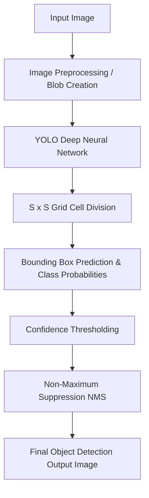

# A
# Mini-Project
# Report on
# “YOLO-Based Object Detection”

**Submitted to the**
**Savitribai Phule Pune University**

**In partial fulfillment for the award of the Mini-Project subject in**
**Artificial Intelligence & Data Science Engineering**

**by**

**Vishal Devidas Raut (48)**

**Under the guidance of**

**Prof. U. B. Bhadange**

**Department Of Artificial Intelligence & Data Science Engineering**
**Pune Vidyarthi Griha's College of Engineering & Shrikrushna S.Dhamankar Institute of Management, Nashik - 422004**

**2025-2026**

---

# CERTIFICATE

This is to certify that **Vishal Devidas Raut (48)** from the institute – **Pune Vidyarthi Griha's College of Engineering & Shrikrushna S.Dhamankar Institute of Management, Nashik**, has successfully completed the Mini Project in the subject **Artificial Neural Network** titled **“YOLO-Based Object Detection”**, during the Academic Year 2025–26. This project was carried out under the supervision and guidance of **Prof. U. B. Bhadange**, in partial fulfillment of the requirements for the Third Year of **Artificial Intelligence & Data Science Engineering** – 2019 Course under **Savitribai Phule Pune University**.

**Date:** __/04/2026
**Place:** Nashik

*(Signatures)*
**Prof. U. B. Bhadange** (Guided by)
**Prof. C.H. Patil** (DAC)
**Prof. S.G. Chordiya** (HOD)

---

# PROBLEM STATEMENT:
In the modern digital era, a vast amount of visual data is generated every day through surveillance systems, autonomous vehicles, smartphones, and various other applications. Identifying and localizing objects within these images manually is time-consuming, inefficient, and prone to human error. Therefore, there is a growing need for automated systems that can accurately and rapidly detect multiple objects within a single image.

This project addresses the problem of developing an efficient, real-time object detection system using the YOLO (You Only Look Once) architecture. Traditional classifiers only identify the presence of an object, but object detection requires drawing precise bounding boxes around each object and classifying them simultaneously.

The objective of this project is to design and implement a YOLO-based model using OpenCV that can effectively process images in a single forward pass, predict bounding boxes, and classify them into appropriate categories with high accuracy and speed. The system aims to provide a reliable solution for object detection which can be extended to real-world real-time video applications.

# INTRODUCTION:
With the rapid growth of computer vision applications, automated systems are heavily relied upon to understand and interact with visual environments. Artificial Intelligence and Deep Learning have made significant advancements in the field of image processing. Among these, YOLO (You Only Look Once) has emerged as a revolutionary architecture for object detection.

Unlike traditional object detection systems that use region proposal networks (which perform detection in multiple steps and are consequently slower), YOLO frames object detection as a single regression problem. It looks at the entire image at once, dividing it into a grid, and predicts bounding boxes and class probabilities simultaneously. 

This project focuses on developing a YOLO-based model to detect and classify objects in images. The system utilizes pre-trained YOLO weights trained on the COCO dataset, which consists of 80 different everyday object categories. Even with complex scenes containing multiple overlapping objects, the YOLO model can efficiently extract meaningful features, localize them, and perform accurate classification in a single pass.

# OBJECTIVES:
• To develop a YOLO (You Only Look Once) model for automatic detection, localization, and classification of objects in images.
• To utilize pre-trained YOLO weights (trained on the COCO dataset) for detecting multiple object categories without requiring extensive retraining.
• To preprocess image data using OpenCV's DNN module by converting it into blobs suitable for neural network input.
• To implement Confidence Thresholding to filter out weak predictions and ensure high-accuracy detections.
• To apply Non-Maximum Suppression (NMS) to eliminate duplicate bounding boxes for the same object.
• To evaluate the performance of the model and understand the practical application of single-shot detectors in real-world scenarios.

# SCOPE OF PROJECT:
The scope of this project is to develop an efficient object detection system using the YOLO architecture and OpenCV. The model leverages pre-trained weights, making it capable of detecting 80 different object categories such as vehicles, animals, people, and everyday items.

This project focuses on processing static images to identify the main objects present, draw bounding boxes around them, and label them with confidence scores. It demonstrates how modern deep learning techniques can be applied to automatically analyze complex visual data with high speed.

While the current scope is limited to static images, the highly optimized nature of YOLO means this exact underlying architecture can be seamlessly extended for real-time video stream processing, webcam surveillance, automated tagging, and intelligent traffic systems.

# LITERATURE REVIEW:
• With the development of deep learning, object detection tasks initially relied heavily on Region-Based Convolutional Neural Networks (R-CNN, Fast R-CNN, Faster R-CNN) which are accurate but computationally expensive and slow.
• YOLO (You Only Look Once) revolutionized the field by framing object detection as a single regression problem, predicting bounding boxes and class probabilities directly from full images in one evaluation.
• YOLO models automatically learn spatial representations and features globally, reducing false positives in background areas compared to region-proposal methods.
• Advanced object detection requires robust implementation. OpenCV's Deep Neural Network (DNN) module provides highly optimized functions for loading pre-trained YOLO configurations and weights, bypassing the need for heavy frameworks like TensorFlow or PyTorch for inference.
• Standard datasets like COCO (Common Objects in Context) are the benchmark for training object detection models, providing a wide variety of classes for robust real-world detection.

# TOOL’S AND TECHNOLOGIES:
• **Programming Language:** Python is used for implementing the model due to its simplicity and strong support for computer vision libraries.
• **Computer Vision Library:** OpenCV (cv2) is used for image reading, preprocessing, drawing bounding boxes, and specifically utilizing its `cv2.dnn` (Deep Neural Network) module to load the YOLO model.
• **Deep Learning Architecture:** YOLO (You Only Look Once) pre-trained configuration and weights.
• **Numerical Library:** NumPy is used for handling arrays, mathematical operations, and manipulating bounding box coordinates.
• **Command Line Interface:** `argparse` is used to allow dynamic passing of input images and model configurations via the terminal.

# WORKING PRINCIPAL:
• **Input Processing:** The model takes an input image and scales it down into a neural network "blob" format (e.g., 416x416 pixels) using OpenCV's `blobFromImage` function.
• **Single Forward Pass:** The blob is fed into the YOLO neural network. The network divides the image into an S x S grid.
• **Prediction:** Each grid cell predicts bounding boxes, confidence scores, and class probabilities for objects whose center falls within that cell.
• **Confidence Thresholding:** The model filters out predictions that have a confidence score lower than a defined threshold (e.g., 0.5), removing weak detections.
• **Non-Maximum Suppression (NMS):** Because multiple grid cells might predict the same object, NMS is applied to remove overlapping bounding boxes, keeping only the box with the highest confidence score.
• **Output Generation:** The final coordinates, class labels, and confidence scores are used to draw rectangles and text labels on the original image, which is then displayed and saved.

# ARCHITECTURE DIAGRAM:



# IMPLEMENTATION

```python
#############################################
# Object detection - YOLO - OpenCV
############################################

import cv2
import argparse
import numpy as np

ap = argparse.ArgumentParser()
ap.add_argument('-i', '--image', required=True, help = 'path to input image')
ap.add_argument('-c', '--config', required=True, help = 'path to yolo config file')
ap.add_argument('-w', '--weights', required=True, help = 'path to yolo pre-trained weights')
ap.add_argument('-cl', '--classes', required=True, help = 'path to text file containing class names')
args = ap.parse_args()

def get_output_layers(net):
    layer_names = net.getLayerNames()
    try:
        output_layers = [layer_names[i - 1] for i in net.getUnconnectedOutLayers()]
    except:
        output_layers = [layer_names[i[0] - 1] for i in net.getUnconnectedOutLayers()]
    return output_layers

def draw_prediction(img, class_id, confidence, x, y, x_plus_w, y_plus_h):
    label = str(classes[class_id])
    color = COLORS[class_id]
    cv2.rectangle(img, (x,y), (x_plus_w,y_plus_h), color, 2)
    cv2.putText(img, label, (x-10,y-10), cv2.FONT_HERSHEY_SIMPLEX, 0.5, color, 2)
    
image = cv2.imread(args.image)

Width = image.shape[1]
Height = image.shape[0]
scale = 0.00392

classes = None
with open(args.classes, 'r') as f:
    classes = [line.strip() for line in f.readlines()]

COLORS = np.random.uniform(0, 255, size=(len(classes), 3))
net = cv2.dnn.readNet(args.weights, args.config)
blob = cv2.dnn.blobFromImage(image, scale, (416,416), (0,0,0), True, crop=False)
net.setInput(blob)
outs = net.forward(get_output_layers(net))

class_ids = []
confidences = []
boxes = []
conf_threshold = 0.5
nms_threshold = 0.4

for out in outs:
    for detection in out:
        scores = detection[5:]
        class_id = np.argmax(scores)
        confidence = scores[class_id]
        if confidence > 0.5:
            center_x = int(detection[0] * Width)
            center_y = int(detection[1] * Height)
            w = int(detection[2] * Width)
            h = int(detection[3] * Height)
            x = center_x - w / 2
            y = center_y - h / 2
            class_ids.append(class_id)
            confidences.append(float(confidence))
            boxes.append([x, y, w, h])

indices = cv2.dnn.NMSBoxes(boxes, confidences, conf_threshold, nms_threshold)

for i in indices:
    try:
        box = boxes[i]
    except:
        i = i[0]
        box = boxes[i]
    
    x = box[0]
    y = box[1]
    w = box[2]
    h = box[3]
    draw_prediction(image, class_ids[i], confidences[i], round(x), round(y), round(x+w), round(y+h))

cv2.imshow("object detection", image)
cv2.waitKey()
cv2.imwrite("object-detection.jpg", image)
cv2.destroyAllWindows()
```

# OUTPUT

*(Insert your final output image with bounding boxes here, e.g., `object-detection.jpg`)*

> [!TIP]
> When compiling your final document, make sure to take a screenshot of the image output generated by OpenCV and paste it in this section.

# CONCLUSION
In this project, an automated object detection system was successfully developed using the YOLO architecture and OpenCV. The model efficiently processed input images in a single forward pass, demonstrating the core strength of the YOLO framework in both speed and accuracy. By applying confidence thresholding and Non-Maximum Suppression, the system successfully localized and classified multiple objects within complex scenes while eliminating duplicate predictions. This project proves that YOLO is a highly effective, robust solution for object detection tasks and lays a solid foundation for extending the application into real-time video processing environments.
